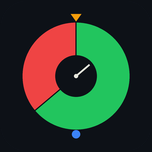

# Interval Timer



A minimal, distraction-free interval timer built for the gym. Designed to be visible from across the room with full-screen color states and oversized typography.

## Features

- **Full-screen color states** — green for GO, red for REST, amber for GET READY, blue for DONE
- **Large typography** — 180pt timer, readable from a distance (1.5x on iPad)
- **Configurable** — work/rest intervals (15s-2m), rounds (5-25)
- **Sound** — generated sine-wave beeps for phase transitions (toggle on/off)
- **Haptic feedback** — on transitions and last 3 seconds
- **Screen wake lock** — stays on during workouts
- **Tap to pause/resume**
- **Landscape only** — optimized for propping up at the gym

## Platforms

- iPhone
- iPad
- macOS

## Screenshots

| Setup | GET READY |
|-------|-----------|
|  |  |

| GO | REST |
|----|------|
|  |  |

| DONE |
|------|
|  |

## Building

```bash
flutter pub get
flutter run
```

### iOS / TestFlight

See [Apple.md](Apple.md) for step-by-step TestFlight deployment instructions.

## Design

The app icon uses a Bauhaus-inspired geometric design — a green/red donut chart with a clock hand, reflecting the work/rest interval concept.

## Support

If you find this useful, [buy me a coffee](https://buymeacoffee.com/twitzelbos).

## License

MIT
